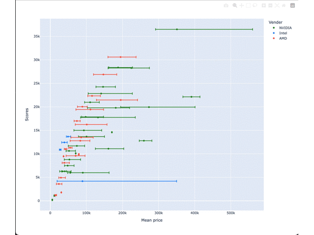

# pc-parts-evaluater
CPUとGPUの日本におけるコストパフォーマンスを調査する

## 目的
PCパーツ選びをしていると，値段とスペックのバランスがどうなのかわからずコスパのいい構成になっているのか自信を持てないことがある．
海外のサイトではベンチマークと価格を併記してあるものの，日本市場でそのままの値段が当てはまるかは怪しい．
そこで，Webスクレイピングを使ってベンチマークと日本での市場価格をそれぞれ取得し，各パーツの価格パフォーマンスを簡単に確認するツールを作成した．

## より詳しい解説記事

[PythonにWEBスクレイピングをやらせてCPUやGPUのコストパフォーマンスをなるべく簡単に比較する - Qiita](https://qiita.com/takakiba/items/b8ab78b3aaf4536789c4)

## 制作環境
Mac
Python 3.9.19

## 必要なライブラリ
(全てpipで入ります)
- requests
- bs4
- pandas
- plotly


## 使い方
### CPUについて確認する場合
```python
### Passmark　ベンチマークスコアを取得する
python get_passmark_scores.py
### 価格.comからCPUの最安価格を取得してくる
python get_cpu_price_list.py
### 価格パフォーマンスをグラフ化する
python get_cpu_value_performance.py
```

### GPUについて確認する場合
```python
### 3DMark ベンチマークスコアを取得する
python get_3dmark_scores.py
### 価格.comからGPUの最安価格を取得してくる
python get_gpu_price_list.py
### 価格パフォーマンスをグラフ化する
python get_gpu_value_performance.py
```

## サンプル
### CPUのデータ
横軸が値段，縦軸がベンチマークスコアなので，左上に行くほどコスパがいいことになります．

### GPUのデータ
縦軸横軸は同じですが，GPUの場合同じチップを載せた製品がたくさん存在するので，価格.com上の最安値と最高値をエラーバーで表現しています．
プロットの点は平均値です．


## 参考文献
- 価格コムのスクレイピングについては丸々こちらを参考にしました．
[価格ドットコムをスクレイピングしてゲーミングPCを調査してみた（前編）](https://happy-shibusawake.com/web-scraping1/559/)

- Beautiful Soupの使い方についてはこちらを参考にしました．
[【Python】Beautiful Soupを使ってブログ記事のテキストを抜き出してみる](https://dev.classmethod.jp/articles/parse-my-article-using-beautiful-soup/)

- スクレイピングをしたCPUベンチマーク，Passmarkの参照先です．
[High End CPUs - Intel vs AMD](https://www.cpubenchmark.net/high_end_cpus.html)

- スクレイピングをしたGPUベンチマーク，3DMarkの参照先です．
[Best Graphics Cards](https://benchmarks.ul.com/compare/best-gpus?amount=0&sortBy=SCORE&reverseOrder=true&types=DESKTOP&minRating=0)


